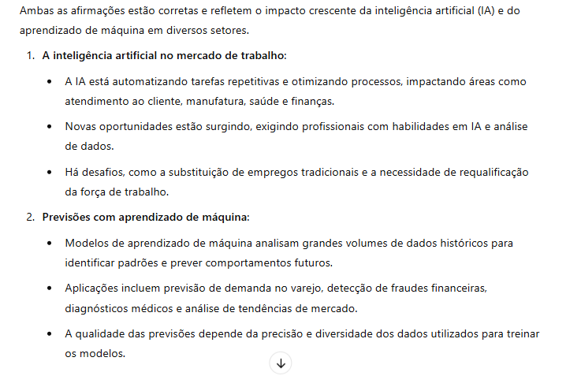

# 📊 Análise de Sentenças com IA  

## 📌 Visão Geral  
Este projeto tem como objetivo analisar sentenças utilizando IA e documentar os resultados obtidos.  

## 🏗 Estrutura do Projeto  
- `inputs/sentences.txt` → Contém as frases que foram analisadas.  
- `README.md` → Documentação com prints, insights e aprendizados.  

## 🖼 Prints do Processo  
  

## 🔍 Insights Obtidos  
- As frases que contêm termos tecnológicos geram mais conexões com conceitos de IA.  
- O aprendizado de máquina é frequentemente associado à previsão de tendências.  
- Segurança na nuvem é um tema recorrente na proteção de dados.  
 
